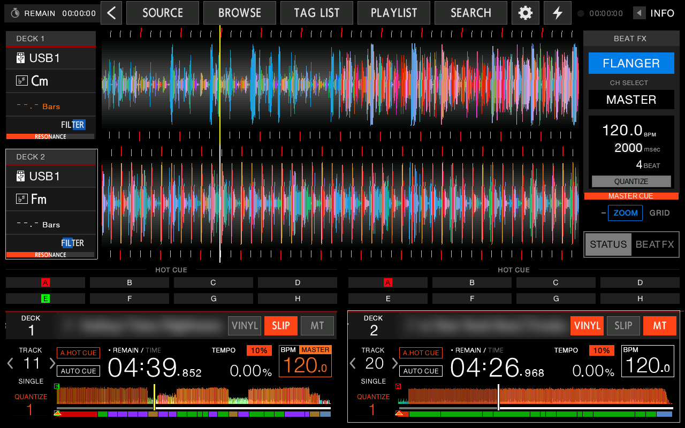
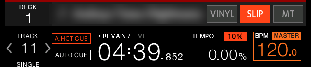
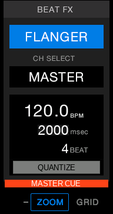
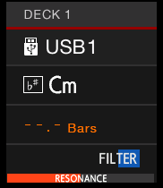
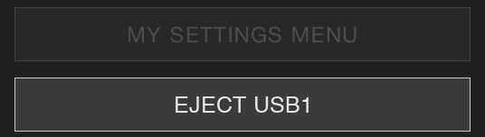
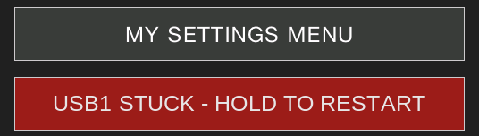

# Full Touch UI for XDJ-RX3

-orange)

A hobby interoperability project: the player software from the Pioneer DJ **XDJ-RX3** firmware (`rbp`, v1.20)
running on a **Wandboard QuadPlus** (same processor family as the XDJ-RX3) with a **7" HDMI touch screen** and a
**DDJ-FLX4**. For XDJ-RX3 owners and enthusiasts — not a product and not a substitute for Pioneer DJ hardware.

**Status:** working, in daily use.

## Background

I started this project to get as close as possible to using the XDJ-RX3's player software on hardware as similar as
possible to the real unit: the same i.MX6 processor family, Pioneer's own Linux kernel and system software, and the
player running unmodified. Once that worked, the missing piece was everything the RX3's hardware provides: its
buttons, knobs, jog wheels and screen controls. So the project grew a DDJ-FLX4 as the control surface and sound
card, and a full touch UI for the RX3 buttons the FLX4 doesn't have.

## ⚠️ Disclaimer

- **Not affiliated with, endorsed by or supported by** Pioneer DJ / AlphaTheta. Their trademarks (Pioneer DJ,
  rekordbox, XDJ-RX3, DDJ-FLX4) are used only to describe what this works with.
- **No proprietary software is included or linked to** — no `rbp`, firmware, libraries, fonts or graphics. Supply
  your own legally obtained XDJ-RX3 v1.20 update and follow its license.
- **Interoperability only:** original code, a GPL kernel port, and facts about how the software talks to its
  hardware. `rbp` is never modified on disk (one behaviour is adjusted in memory); nothing bypasses copy
  protection, licensing or activation.
- **No warranty** — use at your own risk. Don't run the RX3's firmware-update function on this setup. Rights
  holders: please open an issue with any concern.

## 🖥️ Hardware

| Part | Model | Notes |
|---|---|---|
| Board | Wandboard QuadPlus (rev D1) | NXP i.MX6 QuadPlus: 4× Cortex-A9 @ 1 GHz, Vivante GC2000 + GC320 GPU, 2 GB DDR3 — same SoC family as the XDJ-RX3 |
| Screen | ELECROW 7" HDMI display (MPI7002) | 1024×600 panel, fed 1280×800 (the RX3's layout, scaled by the panel); USB HID touch |
| Controller | Pioneer DJ DDJ-FLX4 | Control surface + sound card (4 ch: master 1/2, headphones 3/4); runs on its own power supply |
| USB hub | UUGear MEGA4 (VIA VL817) | Per-port power; **needs its own 5 V supply** (cheap shared splitters caused dropouts). Ports: 1 = USB2, 2 = USB1, 3 = touch, 4 = FLX4 |
| Music | USB sticks / SSD | rekordbox export (FAT32 or exFAT) |

## How it works

The board runs Pioneer's own RX3 software stack: their GPL kernel 3.0.101 ported to the Wandboard, Pioneer's
initramfs and v1.20 root file system, and Pioneer's **unmodified** `rbp`, started by Pioneer's own launcher. Same
SoC family and GPU as the real unit, so the UI is GPU-accelerated exactly as on an RX3.

What the RX3's hardware would provide is supplied by four small `LD_PRELOAD` libraries ("shims"):

| Shim | Stands in for |
|---|---|
| `touchshim-rx3` | the RX3 board: touch controller (from the HDMI screen's USB touch), front-panel processor links, USB over-current inputs, board revision, USB notices |
| `knobshim-flx4` | the RX3's buttons and knobs: DDJ-FLX4 MIDI → RX3 key codes, jog wheels, LEDs, level meters |
| `audioshim-rx3` | the RX3's audio codec: rbp's outputs mixed into the FLX4's 4 channels; MONO SPLIT, MASTER CUE |
| `uishim-rx3` | the RX3's physical buttons that the FLX4 doesn't have: drawn as touch buttons into rbp's frames |

## ✅ What's working

- Full RX3 UI on the 7" screen, GPU-accelerated, no flicker or tearing
- Touch: browsing, list drag scrolling, all on-screen buttons (calibrated)
- Decks: play / cue, jog in VINYL and CDJ mode, tempo, sync, INST DOUBLES, track search, search (seek)
- Performance pads: hot cues, pad FX, beat jump, auto loop; loops
- Mixer: channel faders, crossfader, EQs, trim, CFX (COLOR FX) with parameter
- Beat FX: select, channel, depth, on/off, TAP / AUTO BPM, QUANTIZE
- Headphones: channel CUE (with LEDs), MASTER CUE, HEADPHONE MIX, **MONO SPLIT** and **STEREO**
- Level meters on the FLX4
- Two USB slots like the RX3: rekordbox library from FAT32 and **exFAT** sticks, EJECT per slot
- MASTER REC to USB with TRACK MARK
- TAG LIST, track filter, playlists, search, INFO, SHORTCUT, UTILITY settings
- Countdown timer, screen timers, auto-start at power-on, POWER OFF from the screen

## ⚠️ What's not working / not available

- **REVERSE** — not mapped (left out on purpose)
- **PC link** (USB-B to rekordbox / MIDI mixer mode) — no USB gadget port; the SHORTCUT screen's MIXER MODE "MIDI"
  is dimmed so the mixer can't be handed to a PC that isn't there
- **MIC input, BOOTH output** — the FLX4 has neither
- **Jog display images** — the FLX4 has no jog screens
- Other boards, screens and controllers: not yet — see [`docs/PORTING.md`](docs/PORTING.md)

## 🔄 Not tested

- PRO DJ LINK / LINK EXPORT over the network
- Screen saver (on) — should start when idle; touch should wake it
- HFS+ formatted sticks
- Very long sessions (hours)

## 🎛️ What's added to the screen

The RX3 has physical buttons that the DDJ-FLX4 doesn't. They are drawn into rbp's own frames as touch buttons
(styled after rbp's UI), plus a few additions of this project's own. Close-ups (only the added parts):

 

 

### Stands in for an RX3 hardware button

| On screen | Where | RX3 button it stands in for |
|---|---|---|
| ‹ · SOURCE · BROWSE · TAG LIST · PLAYLIST · SEARCH · ⚙ · ⚡ | top bar (a drop-down on SEARCH) | BACK, the source/browse buttons, MENU (hold = UTILITY), SHORTCUT |
| VINYL · SLIP · MT | each deck's title row | JOG MODE (VINYL/CDJ), SLIP, MASTER TEMPO |
| tap QUANTIZE / tempo range / MASTER tag | each deck's info area | QUANTIZE, TEMPO RANGE, MASTER (tempo) |
| ‹ › beside the track number — tap / hold | each deck | TRACK SEARCH / SEARCH (seek) |
| tap the BPM box — tap / hold 1 s | Beat FX panel | TAP / AUTO (SHIFT + TAP) |
| QUANTIZE button | Beat FX panel | Beat FX QUANTIZE |
| CFX PARAMETER slider (drag) | under each deck's CFX display | COLOR FX PARAMETER knob |
| CFX type + level display | each deck box | the lit COLOR FX buttons |
| TRACK FILTER (tap = on/off, hold = edit) | browse / playlist list header | TRACK FILTER / EDIT |
| TAG TRACK | INFO screen, browse / playlist lists | TAG TRACK / REMOVE |
| rec timer — tap = start, tap = mark, hold 1 s = stop | header | MASTER REC (+ TRACK MARK) |
| EJECT USB1 / USB2 | SOURCE screen | USB STOP |
| POWER OFF (hold 2 s) | UTILITY screen | power switch |
| MASTER CUE tab | under the Beat FX panel | the lit MASTER CUE button |

### New in this project

| Feature | What it does |
|---|---|
| Deck title scrolling | long track titles scroll and stop just before the VINYL button |
| BACK to deck view | where BACK has nothing to go up to (top-level screens), it returns to the deck view |
| USB1 STUCK — hold to restart | if the USB1 stick stops being recognised, a red button on SOURCE restarts the player |
| Touch guards | taps near the track arrows can't toggle REMAIN/TIME; MIXER MODE "MIDI" is dimmed |

Behind the scenes: debounced USB detection and USB1 recovery, FLX4 power-cycling at boot, HDMI mode watchdog,
exFAT support.

## Repository

| Path | Contents |
|---|---|
| `rx3-rootfs/shims/` | the four shims, `hubtool`, `build-shims.sh` |
| `rx3-rootfs/` | board scripts, DirectFB config, u-boot env, SD image builder |
| `rx3-kernel/`, `rx3-uboot/` | kernel port patch (GPL) + Dockerfile, u-boot config |
| `tools/` | button-label generator, deploy and ssh helpers |
| [`docs/BUILD.md`](docs/BUILD.md) | how to build it (tested once from a fresh clone; you supply the firmware and Pioneer's GPL source) |
| [`docs/NOTES.md`](docs/NOTES.md) | the non-obvious facts: kernel fixes, gotchas, what the shims supply |
| [`docs/PORTING.md`](docs/PORTING.md) | adapting it to another board, screen or controller |

## Credits and related projects

- [PrimeBox](https://github.com/erhan-/PrimeBox) — runs the XDJ-RX3 player software on a Denon DJ Prime GO; this
  project started from its patched `rbp`, and its changes pointed to what the shims now provide.
- [cdj3k-emu](https://github.com/nsaintot/cdj3k-emu) — runs CDJ firmware in QEMU on a desktop computer.
- Pioneer DJ (the XDJ-RX3 GPL source), Wandboard.org (board files), Mixxx (DDJ-FLX4 protocol notes),
  Liberation fonts (button labels).

Each project says it ships no Pioneer firmware; they are separate projects with their own scope and risks.

## License

MIT for the original code and docs (`LICENSE`). Exceptions: the kernel port (`rx3-kernel/`) is GPL-2.0, as a
modification of Pioneer DJ's GPL kernel source; `tools/fonts/LiberationSans-Regular.ttf` is SIL OFL 1.1
(`tools/fonts/LiberationSans-LICENSE.txt`).
